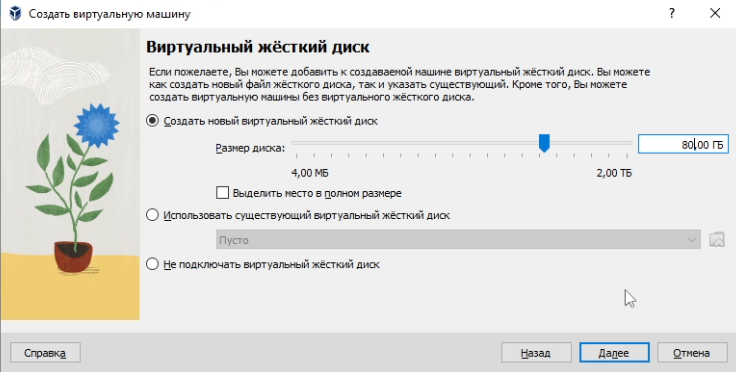
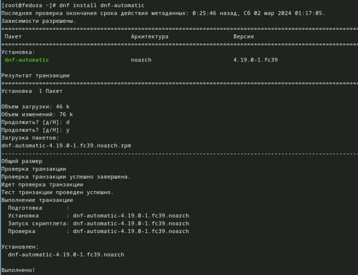
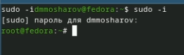
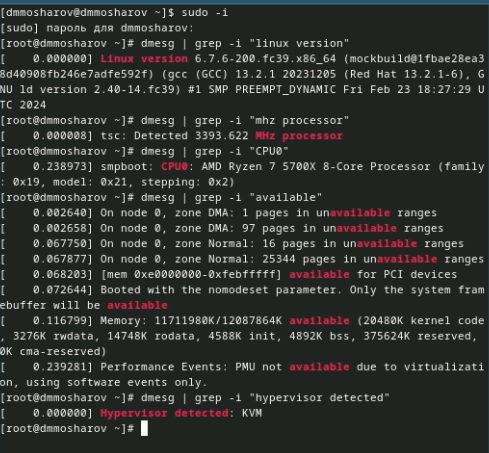

---
## Front matter
title: "Лабораторная работа №2"
subtitle: "Отчёт"
author: "Мошаров Денис Максимович"

## Generic otions
lang: ru-RU
toc-title: "Содержание"

## Bibliography
bibliography: bib/cite.bib
csl: pandoc/csl/gost-r-7-0-5-2008-numeric.csl

## Fonts
mainfont: PT Serif
romanfont: PT Serif
sansfont: PT Sans
monofont: PT Mono
mainfontoptions: Ligatures=TeX
romanfontoptions: Ligatures=TeX
sansfontoptions: Ligatures=TeX,Scale=MatchLowercase
monofontoptions: Scale=MatchLowercase,Scale=0.9

## Pdf output format
toc: true # Table of contents
toc-depth: 2
lof: true # List of figures
lot: true # List of tables
fontsize: 12pt
linestretch: 1.5
papersize: a4
documentclass: scrreprt
## I18n polyglossia
polyglossia-lang:
  name: russian
  options:
	- spelling=modern
	- babelshorthands=true
polyglossia-otherlangs:
  name: english
## I18n babel
babel-lang: russian
babel-otherlangs: english
## Fonts
mainfont: PT Serif
romanfont: PT Serif
sansfont: PT Sans
monofont: PT Mono
mainfontoptions: Ligatures=TeX
romanfontoptions: Ligatures=TeX
sansfontoptions: Ligatures=TeX,Scale=MatchLowercase
monofontoptions: Scale=MatchLowercase,Scale=0.9
## Biblatex
biblatex: true
biblio-style: "gost-numeric"
biblatexoptions:
  - parentracker=true
  - backend=biber
  - hyperref=auto
  - language=auto
  - autolang=other*
  - citestyle=gost-numeric
## Pandoc-crossref LaTeX customization
figureTitle: "Рис."
tableTitle: "Таблица"
listingTitle: "Листинг"
lofTitle: "Список иллюстраций"
lotTitle: "Список таблиц"
lolTitle: "Листинги"
## Misc options
indent: true
header-includes:
  - \usepackage{indentfirst}
  - \usepackage{float} # keep figures where there are in the text
  - \floatplacement{figure}{H} # keep figures where there are in the text
---

# Цель работы

Целью данной работы является приобретение практических навыков установки операционной системы на виртуальную машину, настройки минимально необходимых для дальнейшей работы сервисов.

# Задание

Установка операционной системы 
Установка драйверов для VirtualBox 
Настройка раскладки клавиатуры 
Установка имени пользователя и названия хоста 
Подключение общей папки 
Установка программного обеспечения для создания документации 
Домашнее задание

# Выполнение лабораторной работы

Для начала создадим виртуальную машину. Укажем имя ВМ и адрес к загрузочному носителю (рис. [-@fig:001])

{#fig:001 height=66%}

Далее выделим память и количество ядер процессора (рис. [-@fig:002])

{#fig:002 height=66%}

Выделим виртуальный диск размером в 80гб (рис. [-@fig:003])

{#fig:003 height=66%}

Включим 3D ускорение (рис. [-@fig:004])

{#fig:004 height=66%}

Запустим виртуальную машину и запустим установщик liveinst (рис. [-@fig:005])

{#fig:005 height=66%}

Выберем язык (рис. [-@fig:006])

{#fig:006 height=66%}

И укажем диск для установки (рис. [-@fig:007])

{#fig:007 height=66%}

Включим root пользователя и укажем для него пароль (рис. [-@fig:008])

{#fig:008 height=66%}

Создадим свою учётную запись, укажем имя пользователя, согласно соглашению об именовании и укажем пароль (рис. [-@fig:009])

{#fig:009 height=66%}

После начнётся этап загрузки, после которого мы можем изъять загрузочный диск из ВМ (рис. [-@fig:010])

{#fig:010 height=66%}

Далее загрузим ВМ и перейдём в режим суперпользователя (рис. [-@fig:011])

{#fig:011 height=66%}

Обновим все пакеты с помощью dnf (рис. [-@fig:012])

{#fig:012 height=66%}

Установим mc и tmux с помощью dnf. Все остальные программы также в основном устанавливаются через dnf (рис. [-@fig:013])

{#fig:013 height=66%}

Установим dnf-automatic (рис. [-@fig:014])

{#fig:014 height=66%}

Включим сценарий автообновления (рис. [-@fig:015])

{#fig:015 height=66%}

Отключим SELinux, отредактировав файл /etc/selinux/config следующим образом (рис. [-@fig:016])

{#fig:016 height=66%}

Запустим tmux (рис. [-@fig:017])

{#fig:017 height=66%}

Перейдём в режим root (рис. [-@fig:018])

{#fig:018 height=66%}

Установим Development Tools (рис. [-@fig:019])

{#fig:019 height=66%}

Установим dkms (рис. [-@fig:020])

{#fig:020 height=66%}

Теперь подключим образ диска дополнений гостевой ОС (рис. [-@fig:021])

{#fig:021 height=66%}

Примонтируем его и запустим скрипт-установщик (рис. [-@fig:022])

{#fig:022 height=66%}

Создадим файл конфигурации клавиатуры (рис. [-@fig:023])

{#fig:023 height=66%}

Вставим в него предложенный текст (рис. [-@fig:024])

{#fig:024 height=66%}

Теперь поменяем настройки клавиатуры на следующие (рис. [-@fig:025])

{#fig:025 height=66%}

Теперь поменяем название хоста, согласно соглашению об именовании с помощью hostnamectl (рис. [-@fig:026])

{#fig:026 height=66%}

Добавим нашего пользователя в группу vboxsf (рис. [-@fig:027])

{#fig:027 height=66%}

Создадим общую папку в терминале хост машины (в данном случае Windows), укажем путь к общей папке (C:/work) и название нашей ВМ (Sway) (рис. [-@fig:028])

{#fig:028 height=66%}

Теперь установим pandoc (рис. [-@fig:029])

{#fig:029 height=66%}

Скачаем pandoc-crossref, распакуем его с помощью tar, и перенесём в папку usr/local/bin (рис. [-@fig:030])

{#fig:030 height=66%}

Установим texlive (рис. [-@fig:031])

{#fig:031 height=66%}

# Домашнее задание

Теперь с помощью dmesg получим следующую инофрмацию:
Версия ядра Linux (Linux version). – 6.7.4, Частота процессора (Detected Mhz processor). – 2188Mhz, Модель процессора (CPU0). – Core i5-1340P, Объём доступной оперативной памяти (Memory available). - ~6гб, Тип обнаруженного гипервизора (Hypervisor detected). - KVM (рис. [-@fig:032])

{#fig:032 height=80%}

Тип файловой системы корневого раздела - BTRFS
Последовательность монтирования файловых систем: BTRFS (раздел sda3) и EXT4-fs (Раздел sda2) (рис. [-@fig:033])

{#fig:033 height=66%}

# Выводы

Были получены навыки работы в системе Fedora Sway, была проведена установка системы, установлены необходимые для последующей работы пакеты и произведена базовая настройка системы

# Ответы на контрольные вопросы

1. Какую информацию содержит учётная запись пользователя?
 -Логин пользователя, пароль пользователя, его ID, ID его группы, дополнительная информация (настоящее имя, почта), домашний каталог пользователя  
2. Укажите команды терминала и приведите примеры: 
для получения справки по команде 
 -Используется команда man. Например: man cd – узнать, что делает команда cd  
для перемещения по файловой системе 
 -Используется команда cd. Например: cd ~ - переместиться в домашний каталог  
для просмотра содержимого каталога 
 -Используется команда ls. Например: ls / - посмотреть содержимое корневого каталога  
для определения объёма каталога 
 -Используется команда du. Например: du – выводит размер всех подкаталогов и файлов в каталоге 
для создания / удаления каталогов / файлов 
 -Для создания файлов: touch. Например: touch /test.txt – создать файл test.txt в корне 
 -Для удаления файлов: rm. Например: rm /test.txt – удалить файл test.txt в корне 
 -Для создания каталогов: mkdir. Например: mkdir /test – создать папку test в корне 
 -Для удаления каталогов: rmdir. Например: rmdir /test – удалить папку test в корне 
для задания определённых прав на файл / каталог 
 -Используется команда chmod. Например: chmod +x /test – разрешить исполнение файла test всеми группами и пользователями 
для просмотра истории команд. 
 -Используется команда history. Например: history – выведет историю команд 
3. Что такое файловая система? Приведите примеры с краткой характеристикой. 
 -Файловая система – это система организации файлов в операционной системе. Например: 
FAT – одна из старых файловых систем, представленных Microsoft, не поддерживала шифрование, права пользователей к файлам и не имела возможности журналирования 
EXT4 – Более современная файловая система, которая активно используется в linux, поддерживает журналирование, шифрование и права пользователей к файлам 
4. Как посмотреть, какие файловые системы подмонтированы в ОС? 
Можно посмотреть с помощью утилиты df 
5. Как удалить зависший процесс? 
По PID с помощью команды kill, либо по имени с помощью команды killall

# Список литературы{.unnumbered}

::: {#refs}
:::
