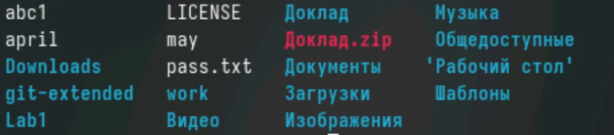
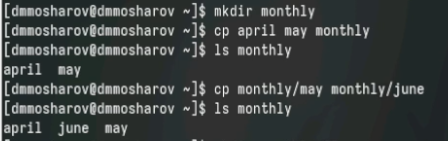
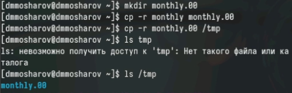
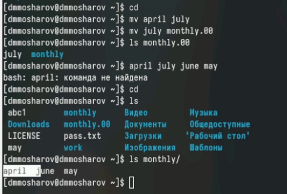
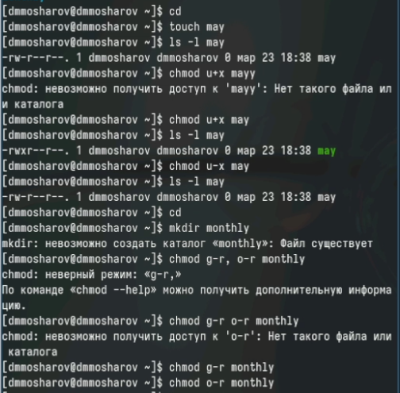
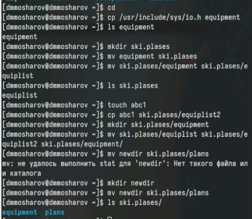
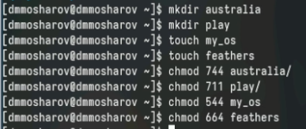
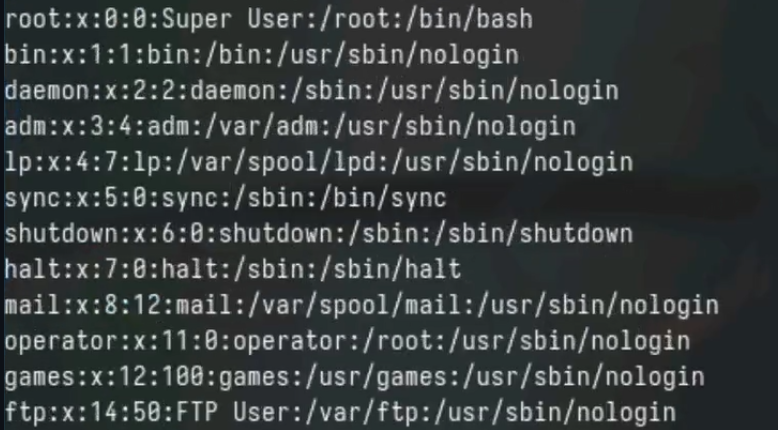
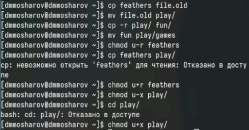
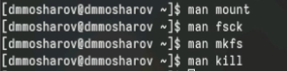

---
## Front matter
title: "Лабораторная работа №7"
subtitle: "Отчёт"
author: "Мошаров Денис Максимович"

## Generic otions
lang: ru-RU
toc-title: "Содержание"

## Bibliography
bibliography: bib/cite.bib
csl: pandoc/csl/gost-r-7-0-5-2008-numeric.csl

## Pdf output format
toc: true # Table of contents
toc-depth: 2
lof: true # List of figures
lot: true # List of tables
fontsize: 12pt
linestretch: 1.5
papersize: a4
documentclass: scrreprt
## I18n polyglossia
polyglossia-lang:
  name: russian
  options:
	- spelling=modern
	- babelshorthands=true
polyglossia-otherlangs:
  name: english
## I18n babel
babel-lang: russian
babel-otherlangs: english
## Fonts
mainfont: PT Serif
romanfont: PT Serif
sansfont: PT Sans
monofont: PT Mono
mainfontoptions: Ligatures=TeX
romanfontoptions: Ligatures=TeX
sansfontoptions: Ligatures=TeX,Scale=MatchLowercase
monofontoptions: Scale=MatchLowercase,Scale=0.9
## Biblatex
biblatex: true
biblio-style: "gost-numeric"
biblatexoptions:
  - parentracker=true
  - backend=biber
  - hyperref=auto
  - language=auto
  - autolang=other*
  - citestyle=gost-numeric
## Pandoc-crossref LaTeX customization
figureTitle: "Рис."
tableTitle: "Таблица"
listingTitle: "Листинг"
lofTitle: "Список иллюстраций"
lotTitle: "Список таблиц"
lolTitle: "Листинги"
## Misc options
indent: true
header-includes:
  - \usepackage{indentfirst}
  - \usepackage{float} # keep figures where there are in the text
  - \floatplacement{figure}{H} # keep figures where there are in the text
---

# Цель работы

Ознакомление с файловой системой Linux, её структурой, именами и содержанием каталогов. Приобретение практических навыков по применению команд для работы с файлами и каталогами, по управлению процессами (и работами), по проверке использования диска и обслуживанию файловой системы. [@tuis]

# Задание

1. Выполните все примеры, приведённые в первой части описания лабораторной работы.  
2. Выполните следующие действия, зафиксировав в отчёте по лабораторной работе используемые при этом команды и результаты их выполнения:  
2.1. Скопируйте файл /usr/include/sys/io.h в домашний каталог и назовите его equipment. Если файла io.h нет, то используйте любой другой файл в каталоге /usr/include/sys/ вместо него.  
2.2. В домашнем каталоге создайте директорию ~/ski.plases.  
2.3. Переместите файл equipment в каталог ~/ski.plases.  
2.4. Переименуйте файл ~/ski.plases/equipment в ~/ski.plases/equiplist.  
2.5. Создайте в домашнем каталоге файл abc1 и скопируйте его в каталог ~/ski.plases, назовите его equiplist2.  
2.6. Создайте каталог с именем equipment в каталоге ~/ski.plases.  
2.7. Переместите файлы ~/ski.plases/equiplist и equiplist2 в каталог ~/ski.plases/equipment.  
2.8. Создайте и переместите каталог ~/newdir в каталог ~/ski.plases и назовите его plans.  
3. Определите опции команды chmod, необходимые для того, чтобы присвоить перечисленным ниже файлам выделенные права доступа, считая, что в начале таких прав нет:  
3.1. drwxr--r-- ... australia  
3.2. drwx--x--x ... play  
3.3. -r-xr--r-- ... my_os  
3.4. -rw-rw-r-- ... feathers  
При необходимости создайте нужные файлы.  
4. Проделайте приведённые ниже упражнения, записывая в отчёт по лабораторной работе используемые при этом команды:  
4.1. Просмотрите содержимое файла /etc/password.  
4.2. Скопируйте файл ~/feathers в файл ~/file.old.  
4.3. Переместите файл ~/file.old в каталог ~/play.  
4.4. Скопируйте каталог ~/play в каталог ~/fun.  
4.5. Переместите каталог ~/fun в каталог ~/play и назовите его games.  
4.6. Лишите владельца файла ~/feathers права на чтение.  
4.7. Что произойдёт, если вы попытаетесь просмотреть файл ~/feathers командой cat?  
4.8. Что произойдёт, если вы попытаетесь скопировать файл ~/feathers?  
4.9. Дайте владельцу файла ~/feathers право на чтение.  
4.10. Лишите владельца каталога ~/play права на выполнение.  
4.11. Перейдите в каталог ~/play. Что произошло?  
4.12. Дайте владельцу каталога ~/play право на выполнение.  
5. Прочитайте man по командам mount, fsck, mkfs, kill и кратко их охарактеризуйте, приведя примеры.  

# Выполнение лабораторной работы

Выполним первый раздел. Научимся копировать файлы с помощью команды cp (рис. [-@fig:001]).

{#fig:001}

Теперь попробуем скопировать файлы в другой каталог (рис. [-@fig:002]).

{#fig:002}

Теперь научимся копировать каталоги (рис. [-@fig:003]).

{#fig:003}

Немного попрактикуемся в перемещении (mv), которое работает схожим образом с cp (рис. [-@fig:004]).

{#fig:004}

Разберёмся с правами доступа. Изменение прав осуществляется с помощью сhmod. Мы можем как давать права (кому+что), так и отнимать (у кого-что) (рис. [-@fig:005]).

{#fig:005}

Выполним второй раздел задания. В нём мы поподробнее разберёмся с тем, как работает копирование и перемещение (рис. [-@fig:006]).

{#fig:006}

Выполним третий раздел задания. В нём нужно задать права доступа для 2ух файлов и 2ух каталогов. Мы будем устанавливать их с помощью восьмеричной записи (рис. [-@fig:007]).

{#fig:007}

В четвёртом разделе просмотрим содержимое файла passwd с помощью cat (рис. [-@fig:008]).

{#fig:008}

Выполним остальную часть раздела. Так, в нём мы узнаём, что мы не можем скопировать файл, если у нас нету прав на его чтение, и не можем перейти в какой-либо каталог, если у нас нет права на его запуск (рис. [-@fig:009]).

{#fig:009}

Теперь с помощью man посмотрим описание команд (рис. [-@fig:010]).
mount - для монтирования файловых систем  
fsck - проверка файловой системы  
mkfs - создание файловой системы Linux  
kill - убить процесс  

{#fig:010}

# Контрольные вопросы

1. btrfs - Корневая файловая система, относительно новая, в ней добавили много возможностей. Однако пока не является стандартом, так как всё ещё может быть нестабильной  
ext4 - Файловая система Linux, самая распространённая
2. Файловая система Linux имеет иерархическую структуру, начиная с корневой директории (/).  
Характеристика каждой директории первого уровня:  
/bin: В этой директории содержатся исполняемые файлы (бинарники), которые необходимы для базового функционирования системы в однопользовательском режиме.   
/boot: В этой директории хранятся файлы, необходимые для загрузки операционной системы. Это включает в себя ядро Linux (vmlinuz), файлы инициализации загрузчика и другие необходимые компоненты.  
/dev: Здесь содержатся файлы, представляющие устройства в системе.   
/etc: Эта директория содержит конфигурационные файлы для различных программ и служб, устанавливаемые в системе.  
/home: Здесь располагаются домашние каталоги пользователей. Каждый пользователь имеет свою собственную поддиректорию в этой директории для хранения своих файлов и настроек.  
/lib: В этой директории хранятся разделяемые библиотеки, которые используются программами во время выполнения.  
/media: Эта директория предназначена для временного монтирования съемных носителей, таких как USB-флешки, CD-ROMы и другие.  
/mnt: Здесь монтируются временные файловые системы. Обычно используется для временного монтирования файловых систем извне основной файловой системы, например, сетевых ресурсов.  
/opt: В этой директории устанавливаются дополнительные программы, не входящие в стандартную поставку дистрибутива.  
/proc: Эта директория представляет виртуальную файловую систему, содержащую информацию о запущенных процессах, настройках ядра и другие системные параметры.  
3. mount  
4. Отсутствие синхронизации, аварийное завершение работы. Исправляется с помощью утилит для проверки дисков 
5. mkfs  
6. cat - выводит всё  
tail - выводит последние 10 строк  
head - выводит первые 10 строк  
7. Копирование, копирование с новым именем, копирование каталогов  
8. Перемещение, перемещение с новым именем, перемещение каталогов  
9. Право читать, записывать и запускать файл. Меняются с помощью chmod  

# Выводы

В результате выполнения лобораторной работы были получены навыки работы с файлами и каталогами, а также было получено понимание работы с правами доступа

# Список литературы{.unnumbered}

::: {#refs}
:::

